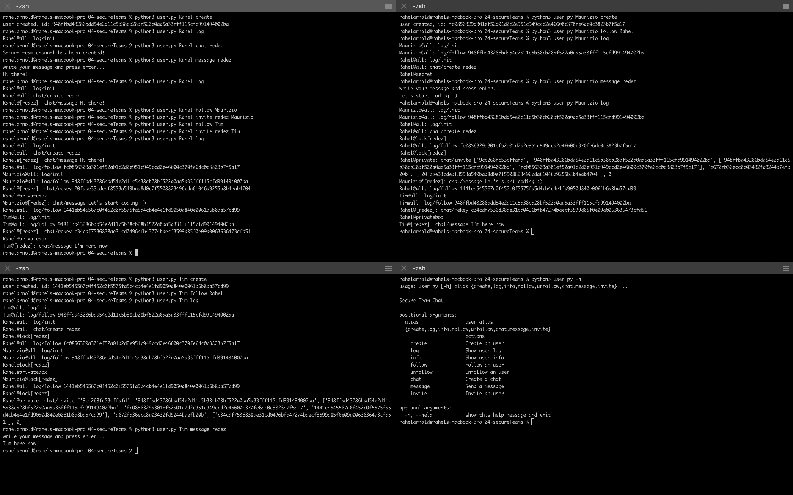

# Secure Team Chat

Secure Team Chat is an application extending BACnet. It allows creating new users as well as following and unfollowing others. Moreover, creating team chats, inviting users to them and exchanging messages within such a group are available features.

## Example



In the picture above there is an example of how a secure team chat might look. The panels on the left top, on the top right and the bottom left are showing each a user. The last panel, the one on the right bottom lists the implemented help instructions.<br/>
The first user gets created on the top left (Rahel). After seeing this in the log a new secure team channel called redez gets created by Rahel, therefore she is the owner. She right starts with sending a message.<br/>
The second user, Maurizio, on the right top gets created next. He starts following Rahel and Rahel follows him back. Then Rahel invites him to the redez group, where Maurizio directly writes the message: Let's start coding :). In Maurizios log, you can see, that he is not able to read the first message of Rahel, because, at the time of the writing, he was not yet a member of the secure team chat.<br/>
The panel on the bottom left shows the interactions of Tim, the third user. He was created last and follows Rahel and she follows him back, as well as invited him to the group redez. The chat message of Tim is also visible to Maurizio, even he does not follow him directly. But Rahel follows Tim and after the sync of Rahel, Maurizio, who follows Rahel, can get Tims message via her.


## Installing dependencies

```
pip install -r requirements.txt
```

## Usage

```
./user.py (alias) <command> [options]
```

`alias`:  a human readable username.

<!-- 
command:
 * create:    create a new user with the given alias
 * log:       show the user log
    options:  -r: show the raw log
 * info:      print user information (fid, follows, channels)
 * follow:    follow another user
    options:  <other_alias>: the alias of the user to follow
 * unfollow:  unfollow another user
    options:  <other_alias>: the alias of the user to unfollow
 * chat:      create a new groupchat
    options:  <chat_alias>: the name of the new chat
 * message:   send a message to the groupchat
    options:  <chat_alias>: the name of the groupchat
    notes:    The chat message can be entered to std_in.
 * invite:    add another user to the groupchat
    options:  <chat_alias>: the name of the groupchat
              <other_alias>: the name of the user to invite

-->

### user.py (alias) create

Create a new user with the alias `alias`.

### user.py (alias) log [-r]

Show the log for the user with the alias `alias`.

#### Log Options: 

* `-r`: Show the raw log.

### user.py (alias) follow (other_alias)

Follow the user `other_alias`. This makes the current user sync the log file of the user with the alias `other_alias`.

### user.py (alias) unfollow (other_alias)

Unfollow the user `other_alias`. This prevents the current user to sync the log file of the user with the alias `other_alias`.

### user.py (alias) chat (chat_alias)

Create a new group chat with the alias `chat_alias`. The current user is automatically a member and the owner of this group chat.

### user.py (alias) message (chat_alias)

Send a message to the group chat with the alias `chat_alias`. This is only possible if the user is a current member of the group.

The message can be entered interactively in the command, and can't be specified as an argument.

### user.py (alias) invite (chat_alias) (user_alias)

Invite the user `user_alias` to the chat `chat_alias`. This issues a rekey and sends this new key via "direct message" to the new member. This command can only be used if the current user is the owner of the group chat.
